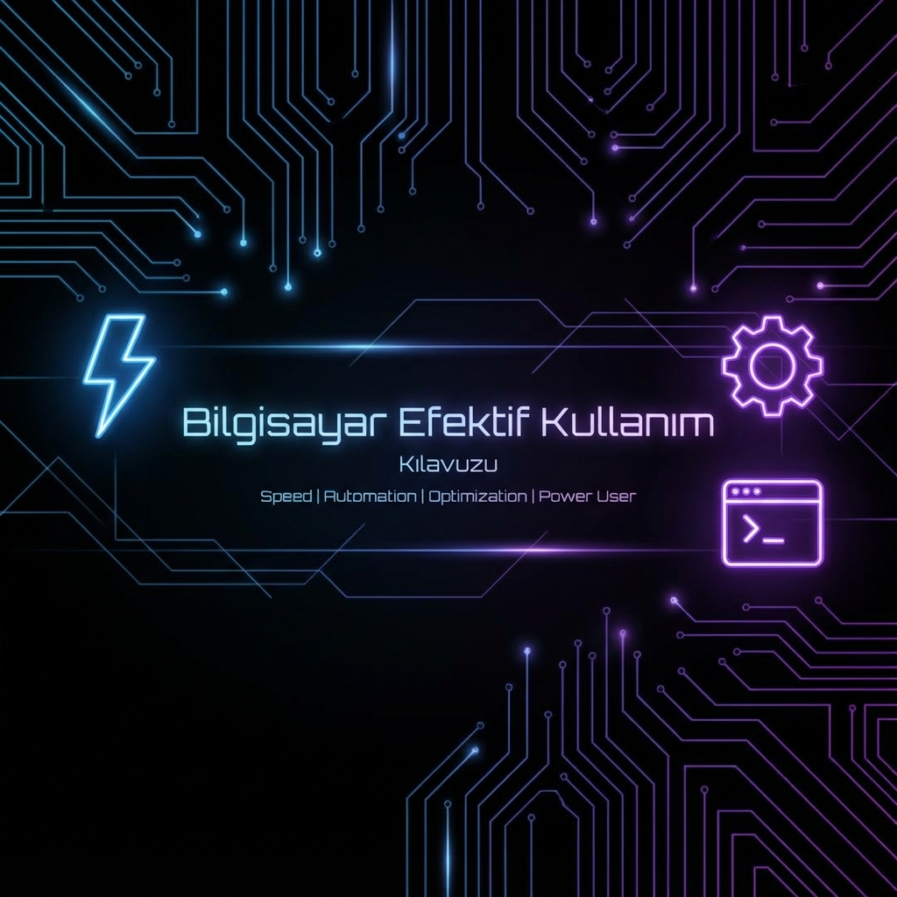

# 🚀 Bilgisayar Efektif Kullanım Kılavuzu


**Bilgisayarınızın gerçek potansiyelini ortaya çıkarın!** ⚡

Bu depo, sıradan bir kullanıcıdan **power user** seviyesine geçmeniz için gerekli olan otomasyon scriptleri, performans ayarları, kısayol hileleri ve geliştirici araçlarını içerir.

---

## 📑 İçerik Tablosu

*   [🌟 Öne Çıkan Özellikler](#-öne-çıkan-özellikler)
*   [⚡ Otomasyon Scriptleri](#-otomasyon-scriptleri)
    *   [1. Lenovo Performance Optimizer](#1-lenovo-performance-optimizer)
    *   [2. Windows 11 Turbo Boost](#2-windows-11-turbo-boost)
    *   [3. Ultimate Ubuntu Setup](#3-ultimate-ubuntu-setup)
*   [📚 Dokümantasyon & Kısayollar](#-dokümantasyon--kısayollar)
*   [🛠️ Kurulum ve Kullanım](#️-kurulum-ve-kullanım)
*   [⚠️ Yasal Uyarı](#️-yasal-uyarı)
*   [🤝 Katkıda Bulunma](#-katkıda-bulunma)

---

## 🌟 Öne Çıkan Özellikler

## 🌟 Öne Çıkan Özellikler

| Özellik | Açıklama |
| :--- | :--- |
| **🧹 Tek Tıkla Temizlik** | Temp, Prefetch ve gereksiz güncelleme artıklarını saniyeler içinde yok eder. |
| **🚀 Gelişmiş Optimizasyon** | RAM temizleme (Garbage Collection), SSD TRIM ve DNS önbellek temizliği ile sistemi hızlandırır. |
| **🗑️ Bloatware Kaldırma** | Windows ile gelen gereksiz uygulamalardan (Xbox, Bing, Skype vb.) kurtulmanızı sağlar. |
| **🐧 Developer Ready** | Ubuntu makinenizi tek script ile Full-Stack geliştirme ortamına çevirir (Docker, VS Code, Node.js, Python...). |
| **⌨️ Gizli Kısayollar** | Verimliliğinizi artıracak, fareyi unutturacak klavye kombo listeleri. |

---

## ⚡ Otomasyon Scriptleri

Klasör: [`scripts/`](scripts/)

### 1. Lenovo Performance Optimizer
Dosya: [`lenovo_optimizer.ps1`](scripts/lenovo_optimizer.ps1)

Özellikle **Lenovo Ideapad Gaming** serisi için optimize edilmiştir ancak çoğu Windows cihazda çalışır.
*   ✅ **RAM & Temp Temizliği:** Bellek sızıntılarını ve şişkinliği alır.
*   ✅ **Servis Yönetimi:** `SysMain`, `DiagTrack` (Telemetri) gibi arkada kaynak tüketen servisleri kapatır.
*   ✅ **Güç Planı:** Cihazı otomatik olarak "Yüksek Performans" moduna zorlar.
*   ✅ **GPU Önceliklendirme:** `Cursor`, `Chrome` ve `VS Code` için grafik kartını öncelikli hale getirir.

### 2. Windows 11 Turbo Boost
Dosya: [`turbu.ps1`](scripts/turbu.ps1)

Windows 11'i uçuş moduna alan **agresif** bir optimizasyon scripti.
*   🚀 **Ultimate Performance:** Windows'un gizli "Ultimate" güç modunu aktif eder.
*   🧹 **Derin Temizlik:** Windows Update artıkları (`dism`) ve Prefetch dosyalarını siler.
*   ⚡ **Registry Tweak:** Menü gecikmelerini (`MenuShowDelay`) sıfırlar, uygulamaların kapanma süresini hızlandırır.
*   🛡️ **Defender Hafifletme:** Windows Defender'ın sürekli tarama özelliklerini kısıtlayarak disk kullanımını düşürür.
*   🗑️ **Bloatware Killer:** Zune, Bing Weather, Skype gibi gömülü uygulamaları kaldırır.
*   💾 **SSD TRIM:** Diskinizi optimize ederek ömrünü uzatır ve hızını korur.

### 3. Ultimate Ubuntu Setup
Dosya: [`ubuntu_setup.sh`](scripts/ubuntu_setup.sh)

Yeni format atılmış bir Ubuntu (22.04/24.04) için "hepsi bir arada" kurulum scripti.
*   **Sistem:** `apt update && upgrade`, temel araçlar (`curl`, `git`, `htop`, `neofetch`).
*   **Diller:** Python (pip, venv), Node.js (LTS), Java (OpenJDK 17), G++ / GCC.
*   **Terminal:** `zsh`, `oh-my-zsh`, `tmux`, `bat` (renkli cat), `exa` (modern ls).
*   **Geliştirme:** VS Code (resmi repo), Docker & Docker Compose.
*   **Ağ & Araçlar:** Postman, Nmap.

---

## 📂 Proje Yapısı

```plaintext
bilgisayar_efektif__kullanim/
├── assets/             # Görsel materyaller ve logolar
├── docs/               # Detaylı dokümantasyon ve rehberler
├── scripts/            # Otomasyon scriptleri (PowerShell, Bash)
│   ├── lenovo_optimizer.ps1
│   ├── turbu.ps1
│   └── ubuntu_setup.sh
├── CONTRIBUTING.md     # Katkıda bulunma rehberi
├── CODE_OF_CONDUCT.md  # Davranış kuralları
├── LICENSE             # MIT Lisansı
└── README.md           # Proje ana sayfası
```

---

## 📚 Dokümantasyon & Kısayollar

Klasör: [`docs/`](docs/)

Bilgi güçtür. Klavyenize hakim olun.

| Dosya | İçerik | Seviye |
|-------|--------|--------|
| [`shortcuts_quick.md`](docs/shortcuts_quick.md) | Günlük hayatı kurtaran %20'lik kısayol dilimi. | 🟢 Başlangıç |
| [`shortcuts_detailed.md`](docs/shortcuts_detailed.md) | Windows, Chrome ve VS Code için A'dan Z'ye rehber. | 🔴 İleri |

---

## 🛠️ Kurulum ve Kullanım

### Windows Scriptleri için
PowerShell scriptlerini çalıştırmadan önce, sisteminizde script çalıştırma iznini açmanız gerekebilir.

1.  **PowerShell**'i Yönetici olarak açın.
2.  İzin verin:
    ```powershell
    Set-ExecutionPolicy RemoteSigned -Scope CurrentUser
    ```
3.  Scripti çalıştırın:
    ```powershell
    cd scripts
    .\turbu.ps1
    ```

### Linux Scripti için
Terminali açın ve dosyaya çalıştırma izni verin:

```bash
chmod +x scripts/ubuntu_setup.sh
./scripts/ubuntu_setup.sh
```

---

## ⚠️ Yasal Uyarı

Bu scriptler sistem ayarlarını değiştirir (Registry, Servisler, Defender vb.).
*   Scriptleri çalıştırmadan önce önemli verilerinizi **YEDEKLEYİN**.
*   Sorumluluk tamamen kullanıcıya aittir.
*   Özellikle `turbu.ps1` içindeki Defender ayarları güvenlik seviyenizi düşürebilir, bilinçli kullanın.

---

## 🤝 Katkıda Bulunma

Bu proje açık kaynaktır ve topluluk katkılarıyla büyür. Yeni bir script eklemek veya varolanı düzeltmek mi istiyorsunuz?
Lütfen [CONTRIBUTING.md](CONTRIBUTING.md) dosyasını okuyun ve bir Pull Request gönderin!

---

## 📜 Lisans

Bu proje [MIT Lisansı](LICENSE) altında lisanslanmıştır. Özgürce kullanabilir, değiştirebilir ve dağıtabilirsiniz.

---

<p align="center">
  <sub>Maden with ❤️ by Bahattin Yunus.</sub>
</p>
