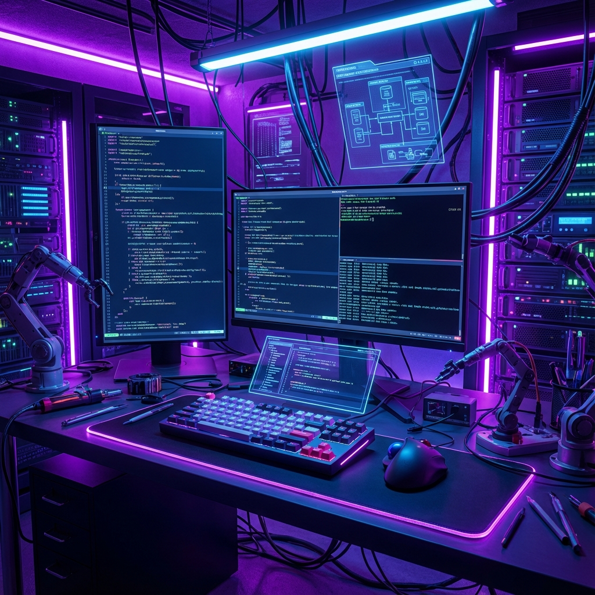

# ⚡ Computer Efficiency Mastery: The Power User Manifesto

> "Bilgisayarını değil, bilgisayarın seni kullansın." — Power User Motto

Bu depo, sıradan bir bilgisayar kullanıcısını **Elite Power User** seviyesine taşımak için tasarlanmış bir bilgi ve otomasyon merkezidir. Fare kullanımını %90 oranında azaltmaya, terminale hükmetmeye ve klavyenizi bir enstrüman gibi kullanmaya hazır mısınız?

---

## 🌌 Temel Sütunlar (The Core Pillars)

Verimlilik üç ana sütun üzerine inşa edilir. Bu depoda her biri için derinlemesine rehberler ve araçlar bulacaksınız:

### 🌙 [1. Neovim Mastery](NEOVIM/README.md)
Dünyanın en güçlü metin editörü. Katmanlar, modlar ve kişiselleştirilebilir Lua konfigürasyonları ile kod yazma hızınızı 3 katına çıkarın.

### 💻 [2. Terminal Mastery](TERMINAL/README.md)
Sadece komut yazmayın, terminali yaşayın. Zsh, PowerShell, `fzf`, `zoxide` ve `ripgrep` gibi modern CLI araçlarıyla dosya sisteminde ışık hızında hareket edin.

### 🖼️ [3. Window Management](WINDOW_MANAGEMENT/README.md)
Ekran alanınızı optimize edin. Windows'ta **PowerToys** ve **GlazeWM**, Linux'ta **i3wm** ve **Hyprland** ile pencereleri elle sürükleme devrini kapatın.

---

## 📚 Bilgi Merkezi (Knowledge Hub)

Tüm teknik bilgiler, kısayollar ve dokümantasyonlar artık merkezi bir yapıda:

- ⌨️ **[Shortcuts](KNOWLEDGE/SHORTCUTS/README.md)**: Windows, Linux ve IDE kısayolları.
- 🧪 **[Labs & Resources](KNOWLEDGE/RESOURCES/LABS/)**: Sistem yönetimi, ağ, güvenlik ve donanım rehberleri (Saha tecrübesi).
- 📜 **[Templates](KNOWLEDGE/TEMPLATES/)**: Mimari şablonlar, checklistler ve raporlama taslakları.
- 🌐 **[Network & Homelab](KNOWLEDGE/NETWORK/)**: Ev laboratuvarı ve ağ yapılandırma detayları.

---

## 🛠️ İşletim Sistemi & Otomasyon

| Bölüm | Açıklama | Konum |
| :--- | :--- | :--- |
| **🚀 Windows Boost** | Windows'u şişkinliklerden arındırın ve performansı uçurun. | [`OS/WINDOWS/`](OS/WINDOWS/) |
| **🐧 Linux Setup** | Yeni bir Linux kurulumunu dakikalar içinde "Dev-Ready" hale getirin. | [`OS/LINUX/`](OS/LINUX/) |
| **📁 Projects** | Geliştirilen mini araçlar ve daemon scriptleri. | [`projects/`](projects/) |

---

## 🚀 Başlangıç (Quick Start)

### Windows kullanıcıları için:
1.  **PowerToys**'u kurun ve **FancyZones**'u yapılandırın.
2.  [`OS/WINDOWS/boost.ps1`](OS/WINDOWS/boost.ps1) scriptini yönetici olarak çalıştırın.
3.  **Windows Terminal**'e geçin ve **Oh My Posh** kurun.

### Linux kullanıcıları için:
1.  [`OS/LINUX/setup.sh`](OS/LINUX/setup.sh) scriptini çalıştırarak temel araçları kurun.
2.  Bir **Tiling Window Manager** (i3 veya Hyprland) deneyin.
3.  Shell olarak **Zsh** ve eklentilerini yapılandırın.

---

## 🤝 Katkıda Bulunun

Bu proje yaşayan bir organizmadır. Yeni bir Neovim eklentisi mi keşfettiniz? Müthiş bir terminal kısayolunuz mu var? Bir Pull Request gönderin ve "Efficiency" ordusuna katılın!

---

## 📜 Lisans & Yasal Uyarı

Bu proje [MIT Lisansı](LICENSE) ile korunmaktadır. Scriptleri kullanmadan önce yedek almayı unutmayın. Sorumluluk kullanıcıya aittir.

---

  Masterfully crafted by <b>Bahattin Yunus</b> with a passion for speed.

